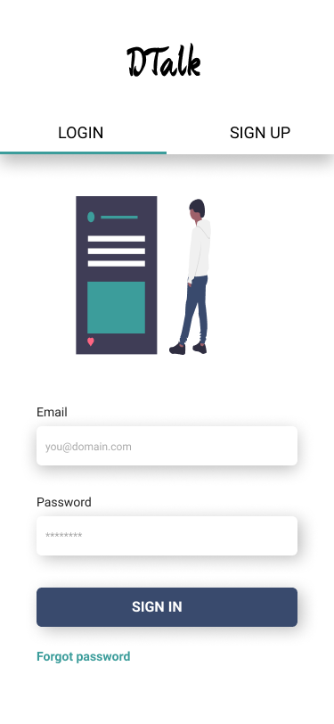
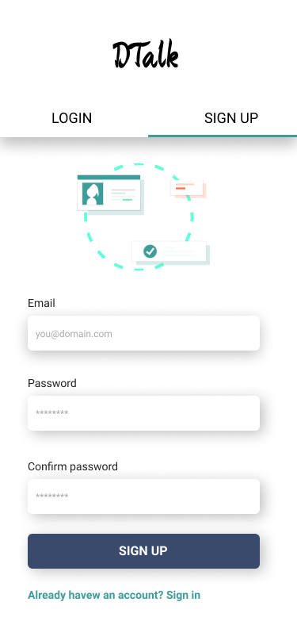
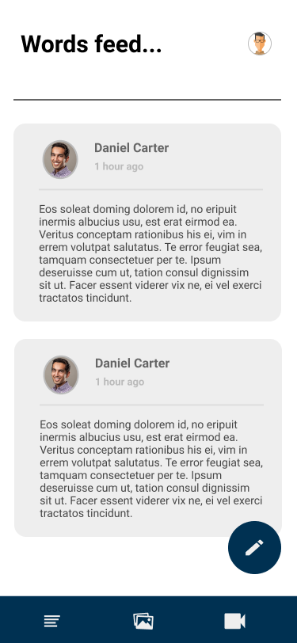

# Dtalk

## Just throw us your words! We assure you we are not collecting your data and not even a single thing you post

## The project

Project developed using technologies such as:

- GraphQL
- KoaJS
- Typescript
- NodeJS
- React
- React Native
- Relay

**Project is under development**. You can check the ongoing through my updates on twitter
or at [my blog](https://www.danmiranda.io).



## A few designs for the mobile app














## Running the project locally

To run this project locally, first clone this project. Make sure you also have yarn package manager installed in your
computer, since this project uses yarn workspaces.

After cloning the project, at the project root run `yarn` to install all the dependencies. This process may take a while.

After having the dependencies installed you can start the server by running `yarn start:server`. You will then be able
to access `https://localhost:3333/graphiql` to see the graphql playground for the API.

The mobile client of this project is currently under development and is quite usable already. If you want to check the
mobile client run:

- `yarn start:mobile:ios`. This will launch the iPhone simulator and start the iOS project (mac only - requires xcode).
- `yarn start:mobile:android`. Make sure to have an Android simulator up and running before firing this command.

## The mobile APP

Running the mobile app will present you with an auth page. You can sign in to an already existing account or create a
new one.

Create an account an then sign in with it.

From now on you can create a new post clicking on the "New Post" badge.

Photo and Video features aren't working yet.
